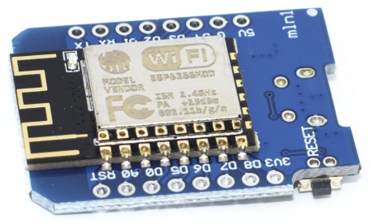

# AirQualitySenser

ESP8266과 미세먼지측정 센서 GP2Y1010AU0F를 이용한 프로젝트 입니다. 프로젝트명 FIFA

측정된 공기품질은 OLED를 통해 display됩니다.

## HW 구성
[Wemos D1 mini (ESP8266)](https://ko.aliexpress.com/item/D1-mini-Mini-NodeMcu-4M-bytes-Lua-WIFI-Internet-of-Things-development-board-based-ESP8266-by/32644199530.html?spm=a2g12.search0104.3.1.543e5ac4gH7f73&ws_ab_test=searchweb0_0,searchweb201602_4_10065_10068_319_317_10696_5733916_10924_453_10084_5733716_454_10083_10618_10920_10921_10922_10307_10712_537_5734316_536_10713_5733816_10059_10884_10887_5734016_100031_321_322_10103,searchweb201603_51,ppcSwitch_0&algo_expid=27f6511a-d9f4-4a92-9d84-45c215702695-0&algo_pvid=27f6511a-d9f4-4a92-9d84-45c215702695) :  $2.14

[OLED](https://ko.aliexpress.com/item/Free-Shipping-White-Blue-Whiteand-Blue-color-0-96-inch-128X64-OLED-Display-Module-For-arduino/32713614136.html?spm=a2g12.search0104.3.1.4a7724edUzz2Wr&ws_ab_test=searchweb0_0,searchweb201602_4_10065_10068_319_317_10696_5733916_10924_453_10084_5733716_454_10083_10618_10920_10921_10922_10307_10712_537_5734316_536_10713_5733816_10059_10884_10887_5734016_100031_321_322_10103,searchweb201603_51,ppcSwitch_0&algo_expid=54cdfd51-2968-41fc-8529-dd13bdc815ad-0&algo_pvid=54cdfd51-2968-41fc-8529-dd13bdc815ad) : $1.85
