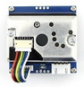

# AirQualitySenser

ESP8266과 미세먼지측정 센서 GP2Y1010AU0F를 이용한 프로젝트 입니다. 프로젝트명 FIFA

측정된 공기품질은 OLED를 통해 display됩니다.

## 목적 ?
우리나라가 공기가 않좋아지고 있습니다. 초등학생들은 평생동안을 미세먼지를 마시며 살아야 하는데  미세먼지가 얼마나 많은지, 외부 운동을을 할수 있는데 알아야 합니다. 엄마하고 미세먼지가 좋음 수치일때 축구를 하기로 했는데 분명 날씨가 좋아 보여도 핸드폰에서 주는 값은 대표 지역의 값이라서 정확도가 떨어 졌어요.  지금 내가 축구하고 싶은 곳의 정확한 미세먼지를 알수 있는 데 장치가 있으면 해서 시작하게 되었습니다. 

## 요구사양
휴대할수 있어야 한다. 

작아야 한다.

주먹보다 작게.

## HW 구성
[Wemos D1 mini (ESP8266)](https://ko.aliexpress.com/item/D1-mini-Mini-NodeMcu-4M-bytes-Lua-WIFI-Internet-of-Things-development-board-based-ESP8266-by/32644199530.html?spm=a2g12.search0104.3.1.543e5ac4gH7f73&ws_ab_test=searchweb0_0,searchweb201602_4_10065_10068_319_317_10696_5733916_10924_453_10084_5733716_454_10083_10618_10920_10921_10922_10307_10712_537_5734316_536_10713_5733816_10059_10884_10887_5734016_100031_321_322_10103,searchweb201603_51,ppcSwitch_0&algo_expid=27f6511a-d9f4-4a92-9d84-45c215702695-0&algo_pvid=27f6511a-d9f4-4a92-9d84-45c215702695) :  $2.14 

[OLED](https://ko.aliexpress.com/item/Free-Shipping-White-Blue-Whiteand-Blue-color-0-96-inch-128X64-OLED-Display-Module-For-arduino/32713614136.html?spm=a2g12.search0104.3.1.4a7724edUzz2Wr&ws_ab_test=searchweb0_0,searchweb201602_4_10065_10068_319_317_10696_5733916_10924_453_10084_5733716_454_10083_10618_10920_10921_10922_10307_10712_537_5734316_536_10713_5733816_10059_10884_10887_5734016_100031_321_322_10103,searchweb201603_51,ppcSwitch_0&algo_expid=54cdfd51-2968-41fc-8529-dd13bdc815ad-0&algo_pvid=54cdfd51-2968-41fc-8529-dd13bdc815ad) : $1.85

[GP2Y1010AU0F 먼지센서](https://ko.aliexpress.com/item/Dust-Sensor-Simple-Air-Monitor-Integrates-GP2Y1010AU0F-Onboard-Detecting-Cigarette-Smoke-PM2-5-Detector-High/32577364143.html?spm=a2g0s.13010208.99999999.272.467f3c00YDpWQg) : $ 12.87

